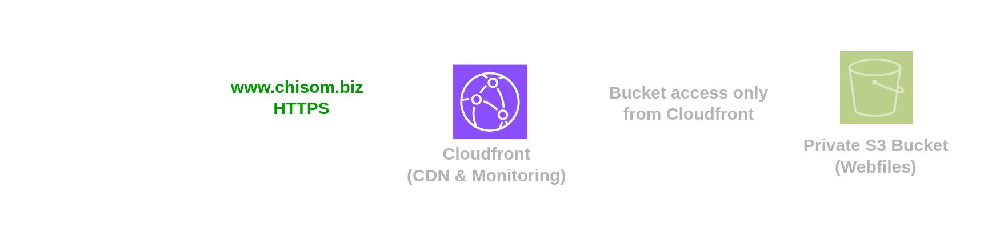

# My Portfolio

This project showcases a personal portfolio website built using **HTML** and **CSS**. The main goal of this project was to strengthen my understanding of front-end web development by creating an interactive, responsive, and visually appealing website.

I am open to feedback, suggestions, and constructive criticism that can help improve this project.

---

# Deployment

## About

This portfolio website is deployed on **AWS Cloud** using **Terraform** as the Infrastructure as Code (IaC) tool to automate the provisioning and management of cloud resources.



---

## Prerequisites

Ensure you have the following installed and configured before running the project:

- Python 3.x or later
- AWS CLI installed and configured with an IAM User that has the required permissions through Access Keys
- An AWS account
- A registered domain name

---

## Setup and Deployment

### 1. Configure Route 53

Create a hosted zone in Amazon Route 53 for your domain.

If your domain is registered with an external provider (such as GoDaddy or Namecheap), update the domain's nameservers to point to the Route 53 nameservers.
***[How to run this project]()***

### 2. Update Configuration

Open the `config.json` file and update the following values:

| Key | Description |
|------|-------------|
| `s3_bucket_name` | A globally unique S3 bucket name. Use lowercase letters, numbers, and hyphens (`-`). |
| `domain_name` | Your primary domain name (e.g., `example.com`). |
| `domain_aliases` | Additional domains or subdomains such as `www.example.com`, `blog.example.com`, etc. |
| `project_name` | A meaningful name used to tag AWS resources created for this project. |
| `hosted_zone_name` | The Route 53 hosted zone name associated with your domain. |

### 3. Deploy the Infrastructure

Open a terminal in the project's root directory and run:

```bash
python3 main.py
```

On Windows:

```powershell
python main.py
```

This script will provision the required AWS infrastructure and deploy the website.

---

## Destroying Resources

To remove all AWS resources created by this project, run:

```bash
python3 destroy.py
```

On Windows:

```powershell
python destroy.py
```

---

## Technologies Used

- HTML
- CSS
- Python
- Terraform
- AWS S3
- AWS CloudFront
- AWS Certificate Manager (ACM)
- AWS Route 53

---


Thank you for taking the time to explore this project ❤️.
